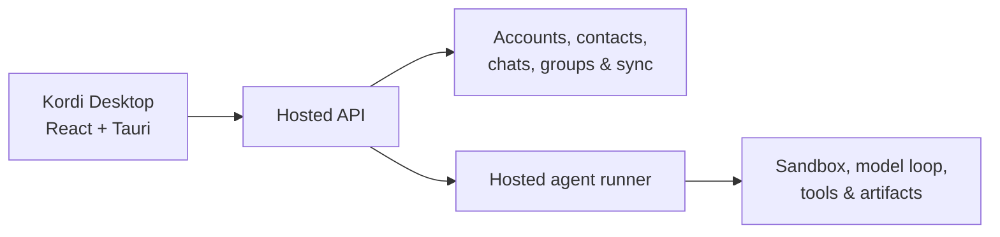

<p align="center">
  
</p>

<p align="center">
  <strong>Bring people and AI agents into the same conversation.</strong>
</p>

<p align="center">
  Kordi is a macOS-first collaboration workspace where people and their agents share chats, context, and work.
</p>

<p align="center">
  <a href="https://github.com/Kordi-AI/Kordi/actions/workflows/ci.yml"></a>
  <a href="https://github.com/Kordi-AI/Kordi/releases"></a>
  
  
</p>

<p align="center">
  <a href="#why-kordi">Why Kordi</a> ·
  <a href="#quick-start">Quick start</a> ·
  <a href="#how-kordi-works">Architecture</a> ·
  <a href="#development">Development</a> ·
  <a href="CONTRIBUTING.md">Contributing</a>
</p>

---

## Why Kordi

AI assistants are usually designed as private, one-person tools. Collaboration is not. Real work happens in shared conversations—with teammates, decisions, context, and different agents that can help at the right moment.

Kordi treats AI as a participant in the conversation. People can chat one-to-one or in groups, bring personal agents into the same shared space, and keep the experience synchronized through a native desktop app.

| | |
| --- | --- |
| **People and agents, together**<br>Invite an agent into the conversation instead of moving the conversation into a separate AI tool. | **Familiar social primitives**<br>Accounts, contacts, direct chats, groups, unread state, and synchronized history. |
| **Agent-native groups**<br>Mention your own Kordi agent—or another participant's agent—inside the group where the context already lives. | **Hosted continuity**<br>A hosted API and agent runner keep collaboration and execution available beyond one local process. |

## Quick start

### Try the beta

Kordi is under active development. macOS beta builds are published on the [Releases page](https://github.com/Kordi-AI/Kordi/releases).

### Run from source

You will need:

- macOS with the [Tauri prerequisites](https://v2.tauri.app/start/prerequisites/) installed
- Node.js 22+
- pnpm 10.29.3+
- a Rust toolchain installed with [`rustup`](https://rustup.rs/)

```bash
git clone https://github.com/Kordi-AI/Kordi.git
cd Kordi
pnpm install --frozen-lockfile
pnpm dev
```

Kordi opens in account login mode and uses the production hosted API at `https://coordinar.io` by default.

> [!IMPORTANT]
> Do not run destructive, load, or throwaway multi-account tests against production. Point development and QA builds at an operator-provided test API or a compatible self-hosted API:
>
> ```bash
> VITE_KORDI_CLOUD_API_BASE=<PUBLIC_TEST_CLOUD_API_BASE> pnpm dev
> ```

For multi-user testing and troubleshooting, see [Run Kordi Desktop](docs/run-cloud-desktop.md).

## How Kordi works



The repository contains the complete product stack:

```text
kordi/
  app/desktop/                 # React + Tauri desktop application
  bridges/cloud-server/        # Auth, chat, sync, and runner coordination API
  bridges/cloud-agent-runner/  # Hosted agent execution and sandboxing
  agent/                       # Shared agent/runtime internals
  shared/                      # Cross-process Rust and TypeScript contracts
  docs/                        # Architecture, development, and release guides
```

Read [Architecture](docs/architecture.md) for the boundaries between the desktop app, hosted services, runner, and shared runtime.

## Development

Install dependencies once with `pnpm install --frozen-lockfile`, then use the root command surface:

| Task | Command |
| --- | --- |
| Start Kordi Desktop | `pnpm dev` |
| Start isolated test users | `VITE_KORDI_CLOUD_API_BASE=<PUBLIC_TEST_CLOUD_API_BASE> pnpm dev:cloud:multi -- --users user1,user2` |
| Build the desktop package | `pnpm build:desktop` |
| Build the web UI | `pnpm build:web` |
| Lint and typecheck | `pnpm lint && pnpm typecheck:web` |
| Check the Rust workspace | `pnpm check:rust` |
| Run the common validation suite | `pnpm check` |

### Documentation

| Guide | What it covers |
| --- | --- |
| [Run Kordi Desktop](docs/run-cloud-desktop.md) | Local startup, API selection, multi-user testing, and troubleshooting |
| [Development commands](docs/development.md) | Full command map and package-specific workflows |
| [Architecture](docs/architecture.md) | Product topology and layer responsibilities |
| [Hosted cloud guide](docs/hosted-cloud-developer-guide.md) | Hosted testing, deployment, and redaction rules |
| [Release guide](docs/release.md) | Desktop packaging and release responsibilities |

## Contributing

Contributions start with a GitHub issue and land through a reviewed pull request. See [CONTRIBUTING.md](CONTRIBUTING.md) for the branch workflow, validation commands, and PR checklist.

Kordi currently targets macOS and is in beta. Product behavior, hosted interfaces, and contributor workflows may evolve as the project approaches a stable release.
