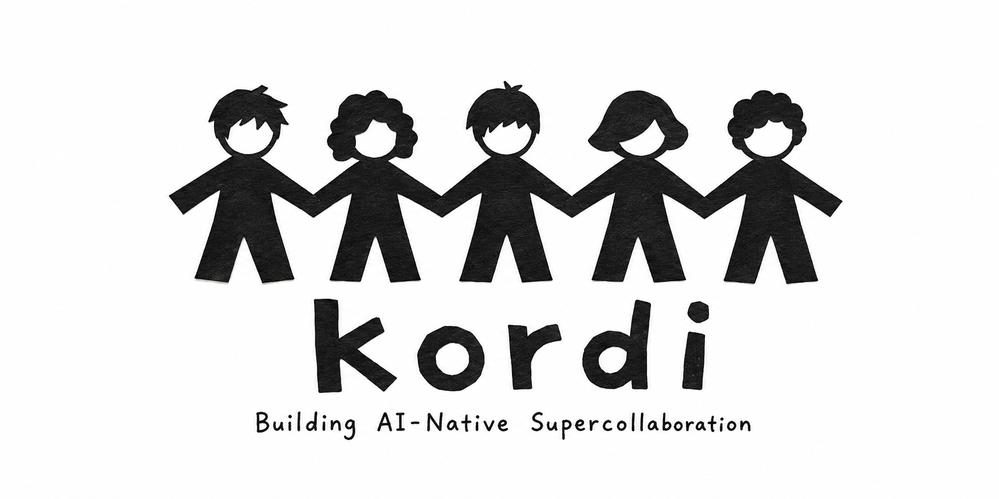
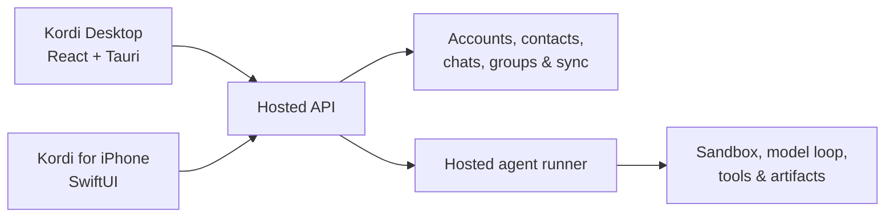

<p align="center">
  
</p>

<p align="center">
  Kordi is an AI-native collaboration workspace for humans and their agents.
</p>

<p align="center">
  <a href="https://github.com/Kordi-AI/Kordi/releases"></a>
  
  
  
</p>

<p align="center">
  <a href="#why-kordi">Why Kordi</a> ·
  <a href="#community">Community</a> ·
  <a href="#quick-start">Quick start</a> ·
  <a href="#how-kordi-works">Architecture</a> ·
  <a href="CHANGELOG.md">Changelog</a> ·
  <a href="#development">Development</a> ·
  <a href="CONTRIBUTING.md">Contributing</a>
</p>

---

## Why Kordi

AI assistants are usually designed as private, one-person tools. Collaboration is not. Real work happens in shared conversations—with teammates, decisions, context, and different agents that can help at the right moment.

Kordi treats AI as a participant in the conversation. People can chat one-to-one or in groups, bring personal agents into the same shared space, and keep the experience synchronized through native desktop and iPhone apps.

| | |
| --- | --- |
| **People and agents, together**<br>Invite an agent into the conversation instead of moving the conversation into a separate AI tool. | **Familiar social primitives**<br>Accounts, contacts, direct chats, groups, unread state, and synchronized history. |
| **Agent-native groups**<br>Mention your own Kordi agent—or another participant's agent—inside the group where the context already lives. | **Hosted continuity**<br>A hosted API and agent runner keep collaboration and execution available beyond one local process. |

## Community

Kordi is in active beta development, and community feedback and contributions help shape how people and agents collaborate.

You can contribute by:

- Trying the beta and opening a focused [bug report or feature proposal](https://github.com/Kordi-AI/Kordi/issues)
- Improving the desktop experience, accessibility, performance, or visual polish
- Fixing account, messaging, synchronization, attachment, or agent-runtime behavior
- Adding regression tests, clearer errors, examples, or documentation

New contributors do not need production infrastructure access. The supported workflow runs an isolated backend and test data on your own machine.

Start with the [community contributor guide](docs/community-contributor-guide.md), then use [CONTRIBUTING.md](CONTRIBUTING.md) for the branch, validation, and review checklist.

## Quick start

### Try the beta

Kordi is under active development. macOS beta builds are published on the [Releases page](https://github.com/Kordi-AI/Kordi/releases).

### Run from source

You will need:

- macOS with the [Tauri prerequisites](https://v2.tauri.app/start/prerequisites/) installed
- Node.js 22+
- pnpm 10.29.3+
- a Rust toolchain installed with [`rustup`](https://rustup.rs/)
- Docker Desktop or Docker Engine with Compose v2

```bash
git clone https://github.com/Kordi-AI/Kordi.git
cd Kordi
pnpm install --frozen-lockfile
pnpm debug:cloud:up
VITE_KORDI_CLOUD_API_BASE=http://127.0.0.1:17081 pnpm dev
```

Kordi opens in account login mode against an isolated Docker backend on your machine. Development launches require an explicit non-production API origin and reject the production origin.

> [!IMPORTANT]
> Do not run destructive, load, or throwaway multi-account tests against production. The local Docker environment is the default contributor workflow. When an approved shared staging environment is required, set its API origin explicitly:
>
> ```bash
> VITE_KORDI_CLOUD_API_BASE=<PUBLIC_TEST_CLOUD_API_BASE> pnpm dev
> ```

Core-maintainer operator work has an additional mandatory preflight. If the requested settings, code, or test will affect or require restarting the product server, develop and test on the corresponding product-server machine and run the first end-to-end validation through `https://coordinar.io`—never `https://kordi.ai`. Desktop-only remote previews continue to use the allowlisted `https://kordi.ai` operator launcher. See [Required preflight before preview or debug](docs/hosted-cloud-developer-guide.md#required-preflight-before-preview-or-debug).

For prerequisites, multi-user testing, logs, troubleshooting, and cleanup, follow the [local development guide](docs/self-hosted-debug.md).

## How Kordi works



The repository contains the complete product stack:

```text
kordi/
  app/desktop/                 # React + Tauri desktop application
  app/ios/                     # Native SwiftUI iPhone application
  bridges/cloud-server/        # Auth, chat, sync, and runner coordination API
  bridges/cloud-agent-runner/  # Hosted agent execution and sandboxing
  agent/                       # Shared agent/runtime internals
  shared/                      # Cross-process Rust and TypeScript contracts
  docs/                        # Architecture, development, and release guides
```

Read [Architecture](docs/architecture.md) for the boundaries between the desktop app, hosted services, runner, and shared runtime.

## Development

Install dependencies once with `pnpm install --frozen-lockfile`, then use the root command surface:

| Task | Command |
| --- | --- |
| Start the isolated backend | `pnpm debug:cloud:up` |
| Check the isolated backend | `pnpm debug:cloud:smoke` |
| Start Kordi Desktop | `VITE_KORDI_CLOUD_API_BASE=http://127.0.0.1:17081 pnpm dev` |
| Test Kordi for iPhone | `xcodebuild -project app/ios/Kordi.xcodeproj -scheme Kordi -destination 'platform=iOS Simulator,name=iPhone 17 Pro' test` |
| Start isolated test users | `VITE_KORDI_CLOUD_API_BASE=http://127.0.0.1:17081 pnpm dev:cloud:multi -- --reset --users user1,user2` |
| Build the desktop package | `pnpm build:desktop` |
| Build the web UI | `pnpm build:web` |
| Lint and typecheck | `pnpm lint && pnpm typecheck:web` |
| Check the Rust workspace | `pnpm check:rust` |
| Run the common validation suite | `pnpm check` |

### Documentation

| Guide | What it covers |
| --- | --- |
| [Community contributor guide](docs/community-contributor-guide.md) | Contribution areas, issues, safe setup, testing, bug reports, and review expectations |
| [Local development](docs/self-hosted-debug.md) | Isolated Docker backend, desktop launch, multi-user testing, safety, and cleanup |
| [Run Kordi Desktop](docs/run-cloud-desktop.md) | Local startup, API selection, multi-user testing, and troubleshooting |
| [Develop Kordi for iPhone](docs/ios-development.md) | Xcode setup, previews, tests, physical devices, architecture, and TestFlight |
| [Development commands](docs/development.md) | Full command map and package-specific workflows |
| [Architecture](docs/architecture.md) | Product topology and layer responsibilities |
| [Hosted cloud guide](docs/hosted-cloud-developer-guide.md) | Hosted testing, deployment, and redaction rules |
| [Changelog](CHANGELOG.md) | User-facing changes since the latest beta release |
| [Release guide](docs/release.md) | Desktop packaging and release responsibilities |

## Contributing

Contributions start with a GitHub issue and land through a reviewed pull request. If this is your first Kordi contribution, read the [community contributor guide](docs/community-contributor-guide.md). See [CONTRIBUTING.md](CONTRIBUTING.md) for the detailed branch workflow, validation commands, and PR checklist.

Kordi currently targets macOS and iPhone and is in beta. Product behavior, hosted interfaces, and contributor workflows may evolve as the project approaches a stable release.
