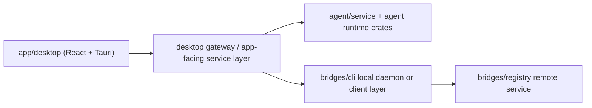

# Kordi Monorepo Plan

This document defines the recommended monorepo layout for Kordi and a migration path from the current three-repo setup:

- `Bridges-app` -> desktop product shell
- `agent` -> agent/runtime backend
- `Bridges` -> network backend

The goal is to move them into one repository **without** losing the architectural boundary between:

- app
- agent
- bridges
- shared contracts

## Recommended top-level structure

```text
kordi/
  app/
    desktop/
      src/
      src-tauri/
      package.json
      vite.config.js

  agent/
    crates/
      core/
      session/
      tools/
      provider/
      hooks/
      plugin-host/
      tui/
      cli/
      kordi-monitor/
      service/                 # new app-facing runtime service crate
    assets/
    docs/
    scripts/

  bridges/
    cli/                       # current Rust backend entry
    registry/                  # current TypeScript registry service
    docs/
    scripts/
    skills/

  shared/
    rust/
      protocol/                # shared Rust types for app-facing contract

  docs/
  scripts/
  Cargo.toml
  package.json
  pnpm-workspace.yaml
  .gitignore
  README.md
```

## Why this structure works

### `app/desktop`

This is the product surface:

- Tauri shell
- React UI
- desktop orchestration
- macOS packaging

It should **not** own the core agent or network logic.

### `agent`

This remains the source of truth for:

- model/runtime orchestration
- sessions
- providers
- hooks
- tools

The current `agent` crate layout is already good. Do not flatten it.

### `bridges`

This remains the source of truth for:

- identity
- trust
- contacts
- projects
- secure transport
- sync
- registry

On day one, keep the current `cli/` and `registry/` split. Do not force an internal Rust refactor during the repo merge.

### `shared`

This is the part worth copying from Codex conceptually.

The desktop UI should not independently understand both the agent runtime and the network daemon. Instead, define a stable contract in `shared/` and make the app talk to that contract through one desktop gateway.

## Recommended service boundary



## Migration strategy

Use two phases.

### Phase 1: Merge repositories without changing product behavior

Import all three repositories into one new root while preserving history.

Use these paths:

- `Bridges-app` -> `app/desktop`
- `agent` -> `agent`
- `Bridges` -> `bridges`

At this point:

- the UI still works from `app/desktop`
- the agent repo still looks like `agent`
- the Bridges repo still looks like `Bridges`

This keeps the migration safe.

### Phase 2: Normalize workspaces and contracts

After import:

1. Promote the `agent` Rust workspace into the monorepo root `Cargo.toml`
2. Add `app/desktop/src-tauri` and `bridges/cli` as workspace members
3. Add `shared/rust/protocol` as the first shared crate
4. Add root `pnpm-workspace.yaml` covering the desktop app and registry packages
5. Only after that, consider deeper backend refactors

## Root Cargo workspace

The practical rule is:

- reuse the current `agent` workspace as the base
- move that workspace definition to the repo root
- rewrite internal crate paths from `crates/...` to `agent/crates/...`

### Root `Cargo.toml` shape

```toml
[workspace]
resolver = "2"
members = [
  "app/desktop/src-tauri",
  "agent/crates/core",
  "agent/crates/session",
  "agent/crates/tools",
  "agent/crates/provider",
  "agent/crates/hooks",
  "agent/crates/plugin-host",
  "agent/crates/tui",
  "agent/crates/cli",
  "agent/crates/kordi-monitor",
  "bridges/cli",
  "shared/rust/protocol",
]

[workspace.package]
version = "0.1.0"
edition = "2024"
license = "MIT"

[workspace.dependencies]
kordi-core = { path = "agent/crates/core" }
kordi-session = { path = "agent/crates/session" }
kordi-tools = { path = "agent/crates/tools" }
kordi-provider = { path = "agent/crates/provider" }
kordi-hooks = { path = "agent/crates/hooks" }
kordi-plugin-host = { path = "agent/crates/plugin-host" }
kordi-tui = { path = "agent/crates/tui" }
kordi-monitor = { path = "agent/crates/kordi-monitor" }
kordi-protocol = { path = "shared/rust/protocol" }

# plus the shared external dependencies currently defined by agent
```

### Important note

Do **not** keep `agent/Cargo.toml` as a second workspace root after migration.  
Once the top-level workspace is created, the old `agent/Cargo.toml` virtual workspace manifest should be backed up and removed or renamed.

## Root pnpm workspace

Use one root workspace for all JavaScript/TypeScript packages:

```yaml
packages:
  - app/desktop
  - bridges
  - bridges/registry
  - shared/typescript/*
```

## Root `package.json`

```json
{
  "name": "kordi",
  "private": true,
  "packageManager": "pnpm@10.29.3",
  "scripts": {
    "dev:desktop": "pnpm --dir app/desktop tauri:dev",
    "build:desktop": "pnpm --dir app/desktop tauri:build",
    "dev:web": "pnpm --dir app/desktop dev",
    "build:web": "pnpm --dir app/desktop build",
    "lint:web": "pnpm --dir app/desktop lint",
    "dev:registry": "pnpm --dir bridges/registry dev",
    "build:registry": "pnpm --dir bridges/registry build",
    "build:rust": "cargo build --workspace",
    "check:rust": "cargo check --workspace",
    "test:rust": "cargo test --workspace"
  }
}
```

## What not to do on day one

Do not do these during the first migration:

- do not rename all Rust crates
- do not split `bridges/cli` into `bridges/core` and `bridges/daemon` yet
- do not rewrite desktop/backend integration at the same time as the repo merge
- do not merge UI code directly with agent/network logic

## Safe post-migration refactor order

After the monorepo is stable:

1. Create `agent/crates/service`
2. Create `shared/rust/protocol`
3. Make `app/desktop` talk to one desktop gateway layer
4. Then split `bridges/cli` internals into `bridges/core` and `bridges/daemon`

## Recommended command flow

1. Create new monorepo root
2. Import repos with history
3. Scaffold root `pnpm` files
4. Promote agent workspace to root `Cargo.toml`
5. Add shared crates/packages
6. Run `cargo check --workspace`
7. Run `pnpm install`
8. Run desktop app from `app/desktop`

## Included scripts

This repo includes two helper scripts for the migration plan:

- `scripts/monorepo/init-kordi-monorepo.sh`
- `scripts/monorepo/adopt-root-workspace.sh`

Use the first to create the new repo and import all three histories.
Use the second after the import to write the new root Rust workspace and shared stubs.
