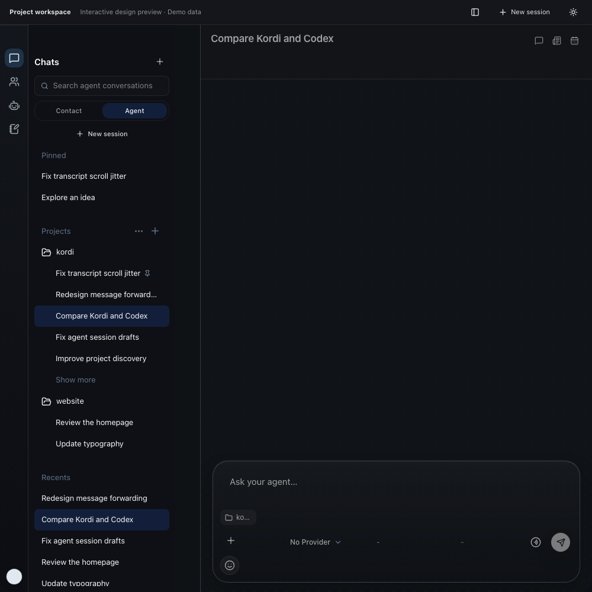
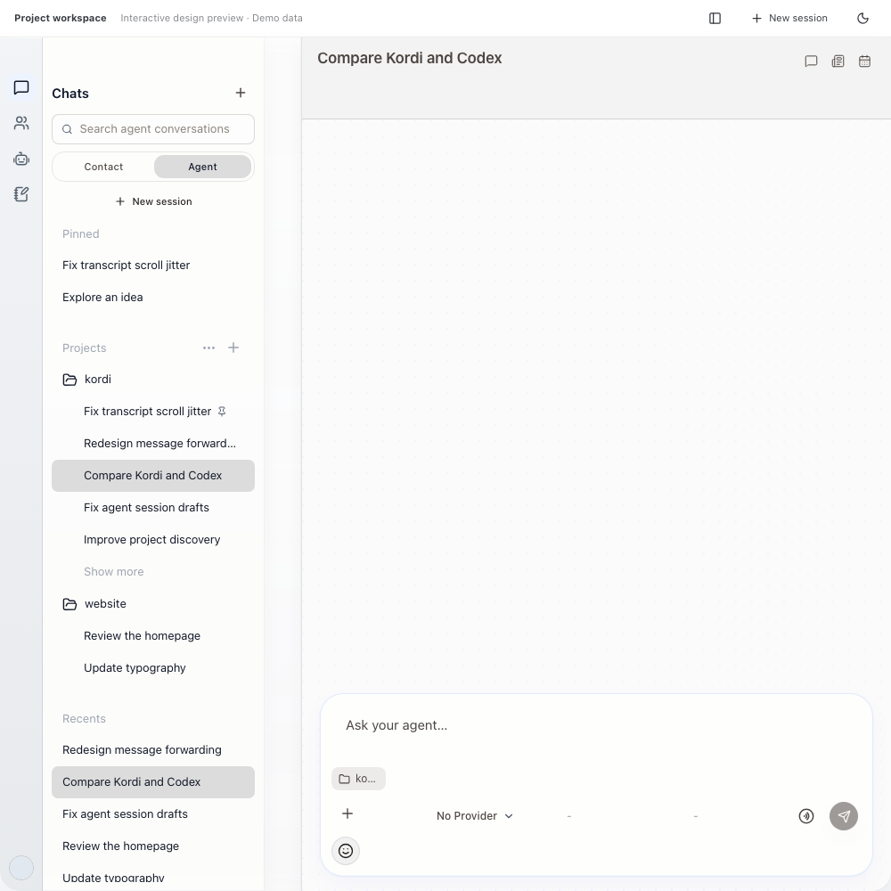

# Projects in Agent Chat

Projects stay in Agent Chat. The composer selects a local workspace. On desktop, the sidebar has Pinned, Projects and Recents sections, with compact titles and indented project chats. Each project initially shows five conversations; Show more reveals the rest without separating a conversation from its forks. The Projects header adds a project or expands and collapses all folders. Recents includes all unpinned chats, including those assigned to projects, so collapsing a folder keeps its chats discoverable. The session context menu moves a chat between projects or removes its project assignment using No project. Changing a project's session binding updates its execution directory; running tasks must stop before their directory changes.

Add project opens a local-folder or GitHub import dialog. Local folders use the native folder picker, with a manual path fallback. GitHub accepts repository URLs or owner/repository, and lists accessible repositories using the user's authenticated GitHub CLI. Public HTTPS cloning works with Git alone; private repositories use existing Git credentials or GitHub CLI authentication. Missing authentication has an actionable error and does not disable URL entry. Credentials never pass through the renderer.

GitHub clones use a newly reserved directory under the selected parent (KordiProjects by default). Existing directories are never overwritten. Completed clones are reused if opening the session needs a retry. Explicit empty project sessions remain discoverable across restarts.

## Local review

Run the desktop Vite development server using the repository's isolated development settings, then open `/tests/visual/chatProjectWorkspace.html`. The preview uses the real sidebar, conversation, project picker and import dialog with synthetic data and an injected import API. It neither reads files nor clones repositories. `?theme=dark` selects dark appearance.

## Desktop preview

Synthetic data rendered by the real Agent Chat components.

## Validation

- Project grouping, fork ancestry, empty sessions and chat routing regression tests.
- Project action tests for draft preservation, background assignments and new sessions.
- Import tests for validated repository inputs and retrying session activation without cloning twice.
- Browser tests for pinning, project previews, grouping, moving sessions, local/GitHub import, search, keyboard use, compact layouts and both appearances.
- Native tests for execution-directory persistence, empty project projection, paths with spaces and existing-directory protection.
- iOS UI coverage opens the composer picker, moves a session, detaches it to Recents, and verifies collapse and expansion.

## iPhone and Mac

iPhone uses Projects and unassigned Recents with Dynamic Type and native sheets. The project chip sits below the composer and includes the import entry. Long-press a session to move it. Project headers contain no session counts or add buttons. Local folder selection opens the system picker on the connected Mac. GitHub discovery uses that Mac's signed-in GitHub CLI, and cloning stays on the Mac.

Project discovery is account-scoped and publishes opaque IDs, names and session membership. Filesystem roots and credentials remain on the Mac. Commands are claimed once by the addressed device; membership is published before a successful acknowledgement. Offline devices remain discoverable, with actions disabled. Project tasks cannot fall back to cloud execution or another Mac's filesystem. Changing projects is blocked while a task is active.

The cloud server must include migration 106 and the project routes. Validate backend changes in an allocated development stack; the existing shared backend is not sufficient until it contains this revision. Build iOS with Kordi Beta and the task's explicit loopback API origin. `--preview-data --preview-agent-page --preview-projects` renders synthetic visual review data without importing real files.
