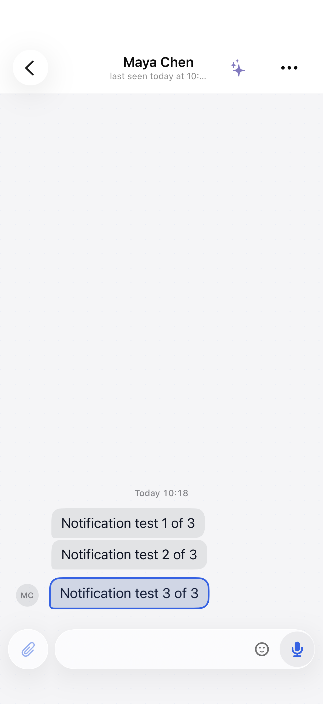
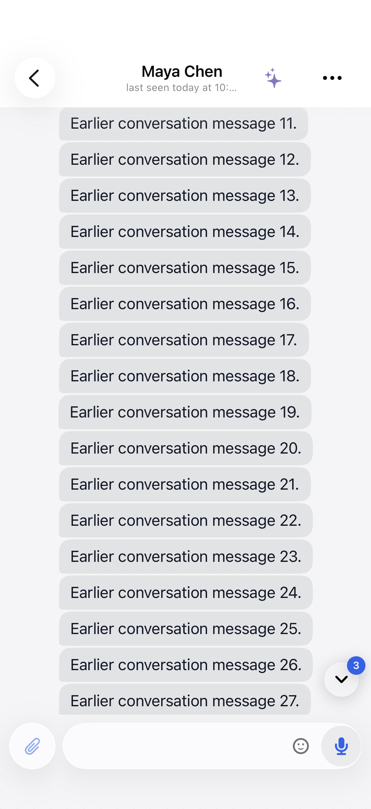

# iOS message notification regression checks

Delivered message notifications follow the current account's read state. Main conversations and thread replies use separate read sequences. New pushes carry `message_sequence`; older pushes resolve their message IDs against cached message aliases. Unknown messages stay in Notification Center until the app can establish that they have been read.

Cleanup runs after read-state changes and foreground synchronization. This does not add a background service extension or immediate cross-device removal while the app is suspended.

## Offline iPhone check

Use a local debug build of **Kordi Beta** with these launch arguments:

```text
--preview-data --preview-notification-cleanup
```

The fixture creates three synthetic messages in Maya's chat and one in Ethan's chat. It requests notification permission without registering an APNs token, then schedules four local notifications 30–36 seconds later. It uses the same message payload parser, navigation, read model, and delivered-notification cleanup as remote message notifications.

1. Allow notifications, then return to the Home Screen without opening either test chat.
2. Wait for all four notifications.
3. Tap Maya's third notification. The three messages should appear above the composer.
4. Inspect Notification Center. Maya's notifications should be removed; Ethan's should remain.
5. Relaunch with the same arguments to reset the fixture. Repeat by opening the app icon and then Maya's chat.

This fixture is compiled only in debug builds and requires preview mode. It validates local iOS delivery and removal, not the APNs transport or production backend. Follow the local device-signing rules when installing Beta.

## Automated coverage

Run `MessageNotificationCleanupTests`, `ConversationScrollNavigationTests`, and `ConversationReadVisibilityProbeTests` in the `KordiTests` target using the `Kordi Beta` scheme. They cover read boundaries, old payloads, account changes during cleanup, queued cleanup requests, short and long transcripts, and delayed scroll commands.

The server's `message_payload_uses_absolute_badge_thread_and_opaque_routing_fields` test verifies the sequence field alongside the existing routing, badge, and grouping fields.

## Rendered examples

Both screenshots use synthetic test data captured from the hosted navigation regression tests.

### Latest notification in a short chat

The transcript stays above the composer, including after the deferred message jump.



### Older notification in a long chat

The requested historical message remains centered instead of moving to the latest message.


